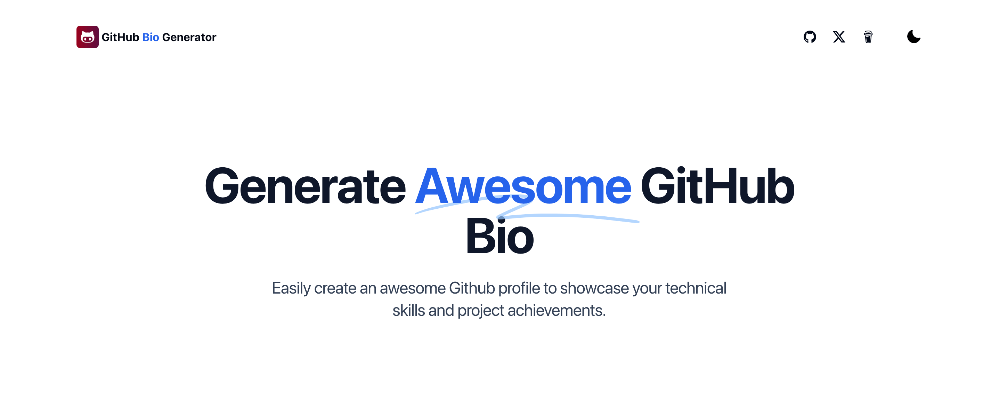

🌍 *[英文](README.md) ∙ [简体中文](README-zh.md)*

# [Github Bio Generator](https://www.githubbio.com/)

轻松创建一个好看的 Github 个人简介，展示您的技术技能和项目成就。

[](https://www.githubbio.com/)

## 技术栈

Github Bio Generator 基于以下技术栈构建：

- Next.js – 前端
- TailwindCSS – 样式
- Shadcn – UI
- Google Analytics - 分析（[如何使用？](https://weijunext.com/article/979b9033-188c-4d88-bfff-6cf74d28420d)）
- Vercel - 托管
- Github 统计 - [github-readme-stats](https://github.com/anuraghazra/github-readme-stats)


## 本地运行

克隆仓库后，您需要复制 `.env.example` 文件来创建一个 `.env` 文件，并填写所需字段。

然后，在命令行中运行应用程序，它将在 `http://localhost:3000` 上可用。

```bash
npm run dev
```

## 一键部署

使用 [Vercel](https://vercel.com?utm_source=github&utm_medium=readme&utm_campaign=vercel-examples) 部署：

[](https://vercel.com/new/clone?repository-url=https://github.com/weijunext/github-bio-generator&project-name=&repository-name=github-bio-generator&demo-title=GithubBioGenerator&demo-description=Generate%20the%20Github%20bio%20in%20seconds.&demo-url=https://githubbio.com&demo-image=https://githubbio.com/og.png)

## 关于我
我是一名**前端工程师**、**全栈实践者**，**AI降临派**。

[博客](https://weijunext.com)  
[Github](https://github.com/weijunext)  
[Twitter / X](https://twitter.com/weijunext)  
[Medium](https://medium.com/@weijunext)  
[掘金](https://juejin.cn/user/26044008768029)  
[知乎](https://www.zhihu.com/people/mo-mo-mo-89-12-11)  
[微信交流群](https://weijunext.com/make-a-friend)  

如果这个项目对您有帮助，请给仓库点个star，或者请我喝杯咖啡，谢谢。

<a href="https://www.buymeacoffee.com/weijunextz" target="_blank"></a>
